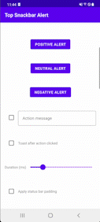

# top-snackbar-alert


Superpowered snackbar alert for Android which is shown at the top of the screen.




## Usage

### Initialization

You can create the snackbar alert from any activity, fragment or view.

```kotlin
// Activity
TopSnackbar.show(
    activity = this,
    message = "This is a positive Alert",
    type = TopSnackbar.Type.Positive
)

// Fragment
TopSnackbar.show(
    fragment = this,
    message = "This is a positive Alert",
    type = TopSnackbar.Type.Positive
)

// View
TopSnackbar.show(
    view = this,
    message = "This is a positive Alert",
    type = TopSnackbar.Type.Positive
)
```

### Options

You can configure the snackbar by setting several options:
- onActionClicked: function to be called after the action has been clicked (expects an actionmessage to be provided)
- actionMessage: text to be shown as text button action on the right side of the notification
- duration: Duration.kt instance 
- applyStatusBarTopMarginToMessage: When the screen is fullscreen, this ensures to add a status bar top margin to your alert

There are three types of alerts:
- TopSnackbar.Type.Neutral
- TopSnackbar.Type.Positive
- TopSnackbar.Type.Negative

```kotlin
val options = TopSnackbar.Options(
    onActionClicked = ::displayToast,
    actionMessage = "Snackbar was clicked",
    duration = 2000.toDuration(DurationUnit.MILLISECONDS),
    applyStatusBarTopMarginToMessage = true
)

TopSnackbar.show(
    view = this,
    message = "This is a positive Alert",
    type = TopSnackbar.Type.Positive,
    options = options
)
```

### Customization

If you want to customize the layout of the alerts, you can override the following values in your resources folder with own colors:

```xml
<color name="tsb_text_neutral">#000000</color>
<color name="tsb_text_positive">#000000</color>
<color name="tsb_text_negative">#000000</color>

<color name="tsb_background_neutral">#F2F2F2</color>
<color name="tsb_background_positive">#05E676</color>
<color name="tsb_background_negative">#E60230</color>
```

## Installation

Add it in your root build.gradle at the end of repositories:
```gradle
allprojects {
  repositories {
    ...
    maven { url 'https://jitpack.io' }
  }
}
```

Add the dependency to your module level build.gradle:
```gradle
dependencies {
  implementation 'com.github.bornholdtleegmbh:top-snackbar-alert:1.0.0'
}
```